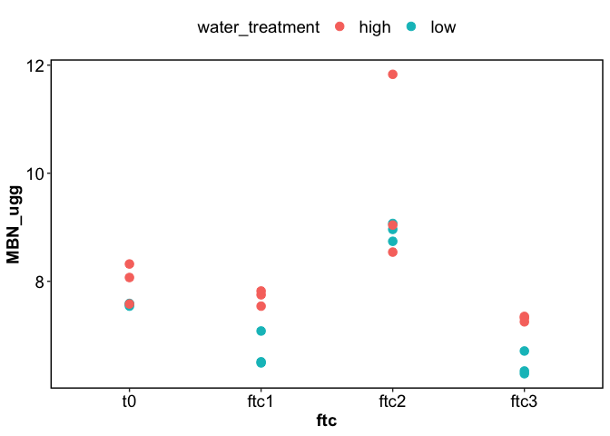

Untitled
================

# XCT

## PNM

<!-- --><!-- -->

<!-- -->

<!-- --><!-- -->

<!-- --><!-- -->

<!-- -->

## Summaries

<!-- -->

<!-- --><!-- -->

# RESPIRATION

<!-- -->

<!-- -->

<!-- -->

# WEOM

<!-- -->

<!-- --><!-- --><!-- -->

------------------------------------------------------------------------

## Session Info

Session Info

Date run: 2025-07-11

    ## R version 4.5.0 (2025-04-11)
    ## Platform: aarch64-apple-darwin20
    ## Running under: macOS Sequoia 15.5
    ## 
    ## Matrix products: default
    ## BLAS:   /Library/Frameworks/R.framework/Versions/4.5-arm64/Resources/lib/libRblas.0.dylib 
    ## LAPACK: /Library/Frameworks/R.framework/Versions/4.5-arm64/Resources/lib/libRlapack.dylib;  LAPACK version 3.12.1
    ## 
    ## locale:
    ## [1] en_US.UTF-8/en_US.UTF-8/en_US.UTF-8/C/en_US.UTF-8/en_US.UTF-8
    ## 
    ## time zone: America/Los_Angeles
    ## tzcode source: internal
    ## 
    ## attached base packages:
    ## [1] stats     graphics  grDevices utils     datasets  methods   base     
    ## 
    ## other attached packages:
    ##  [1] googlesheets4_1.1.1 lubridate_1.9.4     forcats_1.0.0      
    ##  [4] stringr_1.5.1       dplyr_1.1.4         purrr_1.0.4        
    ##  [7] readr_2.1.5         tidyr_1.3.1         tibble_3.3.0       
    ## [10] ggplot2_3.5.2       tidyverse_2.0.0     tarchetypes_0.13.1 
    ## [13] targets_1.11.3     
    ## 
    ## loaded via a namespace (and not attached):
    ##  [1] gtable_0.3.6         xfun_0.52            processx_3.8.6      
    ##  [4] lattice_0.22-6       gargle_1.5.2         callr_3.7.6         
    ##  [7] tzdb_0.5.0           vctrs_0.6.5          tools_4.5.0         
    ## [10] ps_1.9.1             PNWColors_0.1.0      generics_0.1.3      
    ## [13] base64url_1.4        parallel_4.5.0       pkgconfig_2.0.3     
    ## [16] Matrix_1.7-3         data.table_1.17.0    secretbase_1.0.5    
    ## [19] RColorBrewer_1.1-3   distributional_0.5.0 lifecycle_1.0.4     
    ## [22] compiler_4.5.0       farver_2.1.2         codetools_0.2-20    
    ## [25] htmltools_0.5.8.1    yaml_2.3.10          pillar_1.10.2       
    ## [28] nlme_3.1-168         tidyselect_1.2.1     digest_0.6.37       
    ## [31] stringi_1.8.7        labeling_0.4.3       splines_4.5.0       
    ## [34] fastmap_1.2.0        grid_4.5.0           cli_3.6.5           
    ## [37] magrittr_2.0.3       withr_3.0.2          prettyunits_1.2.0   
    ## [40] scales_1.4.0         backports_1.5.0      googledrive_2.1.1   
    ## [43] timechange_0.3.0     rmarkdown_2.29       igraph_2.1.4        
    ## [46] cellranger_1.1.0     hms_1.1.3            evaluate_1.0.3      
    ## [49] knitr_1.50           ggdist_3.3.3         mgcv_1.9-1          
    ## [52] rlang_1.1.6          Rcpp_1.0.14          glue_1.8.0          
    ## [55] rstudioapi_0.17.1    R6_2.6.1             fs_1.6.6

