Untitled
================

# XCT

## PNM

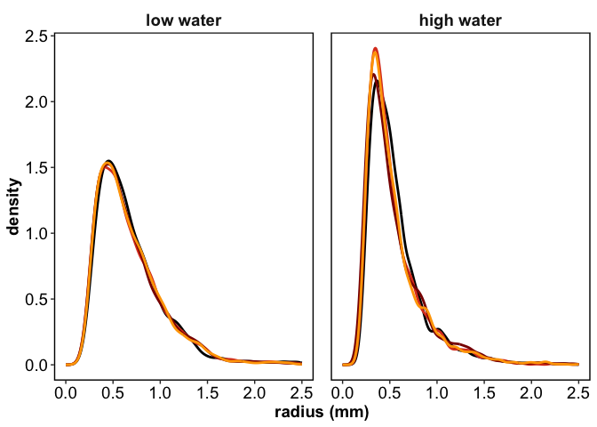<!-- -->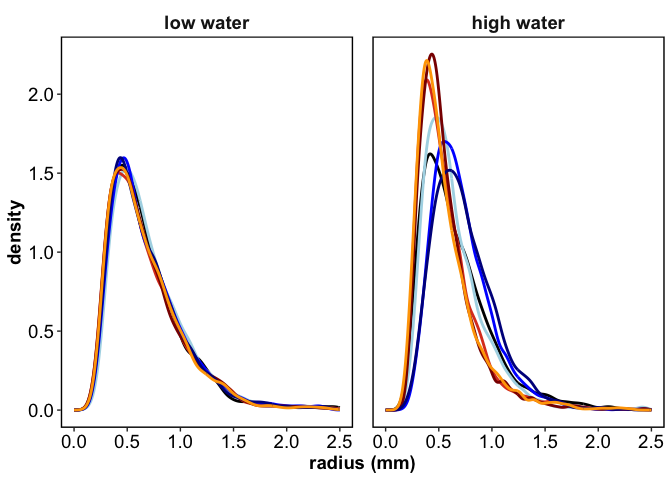<!-- -->

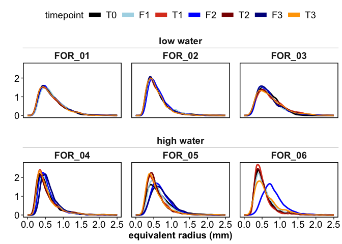<!-- -->

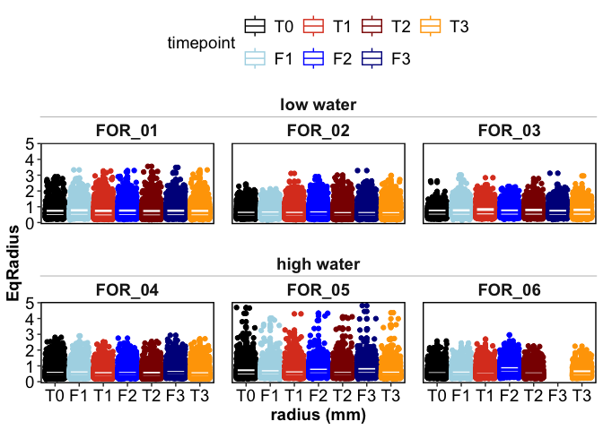<!-- -->

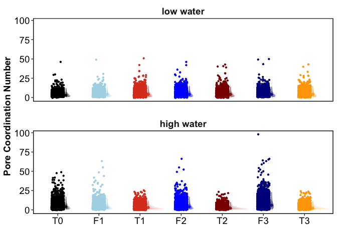<!-- -->

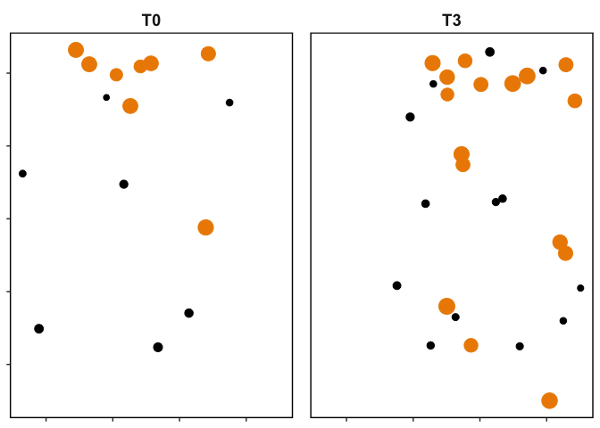<!-- -->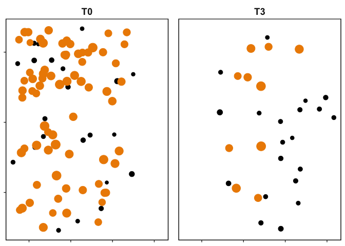<!-- -->

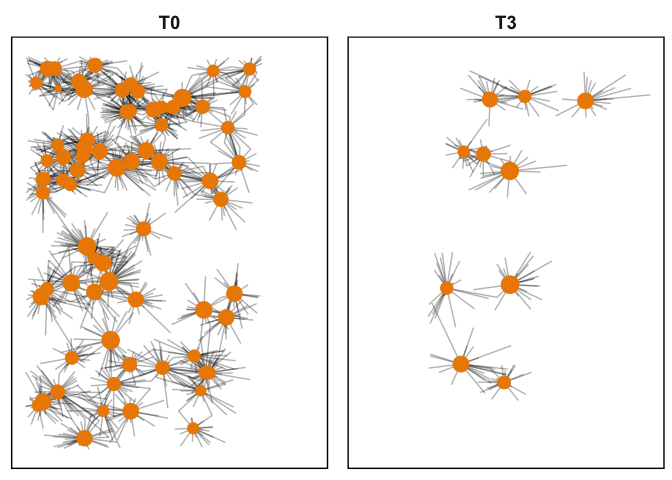<!-- -->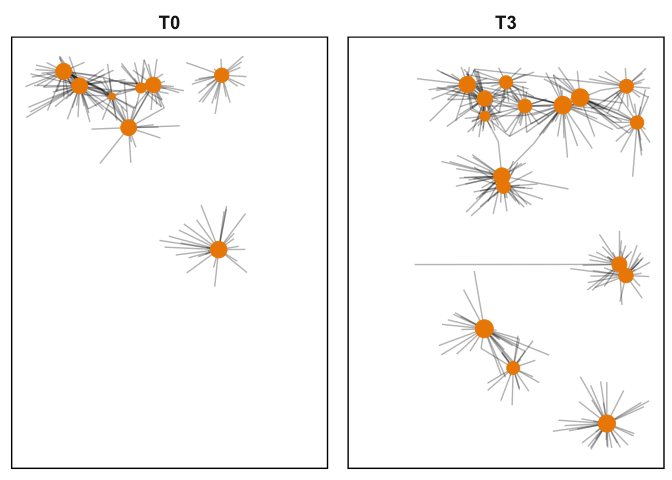<!-- -->

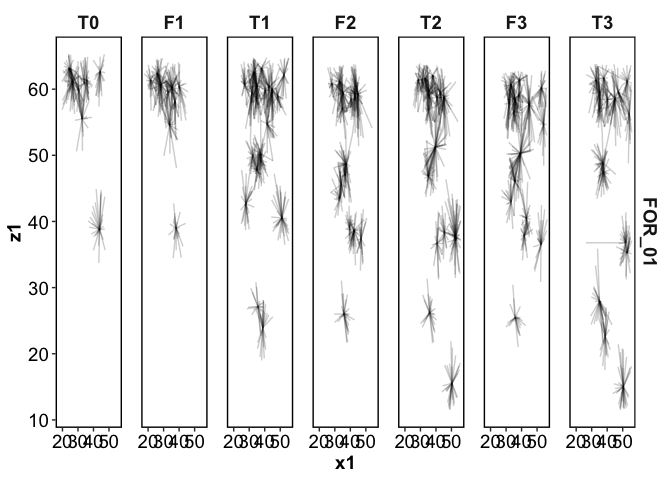<!-- -->

## Summaries

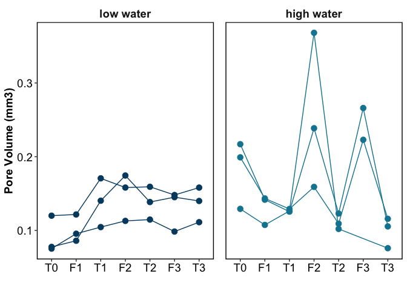<!-- -->

<!-- -->

# RESPIRATION

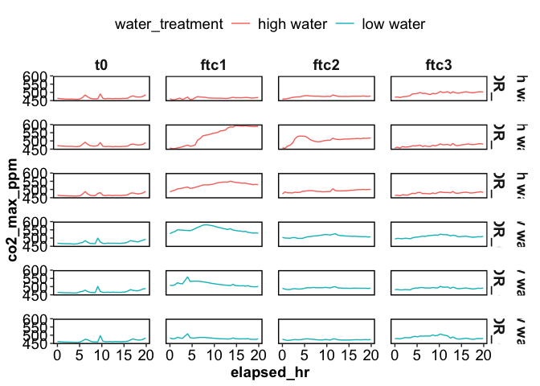<!-- -->

<!-- -->

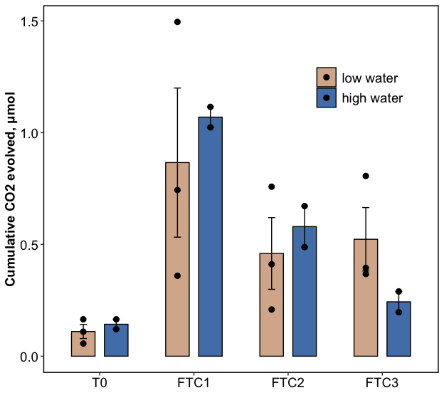<!-- -->

# WEOM

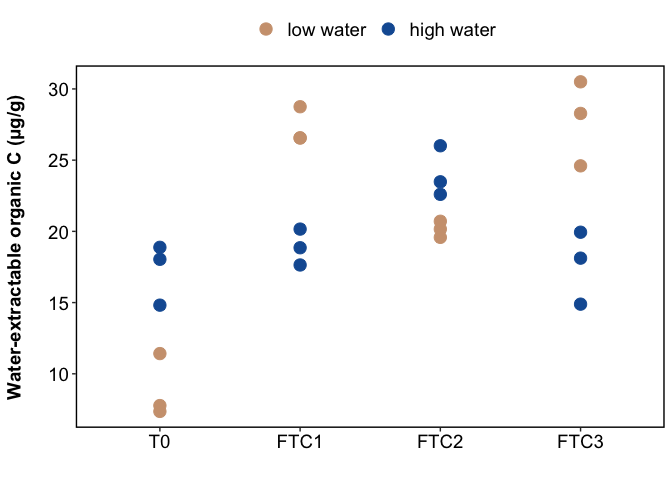<!-- -->

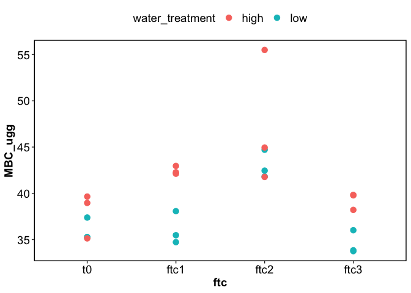<!-- -->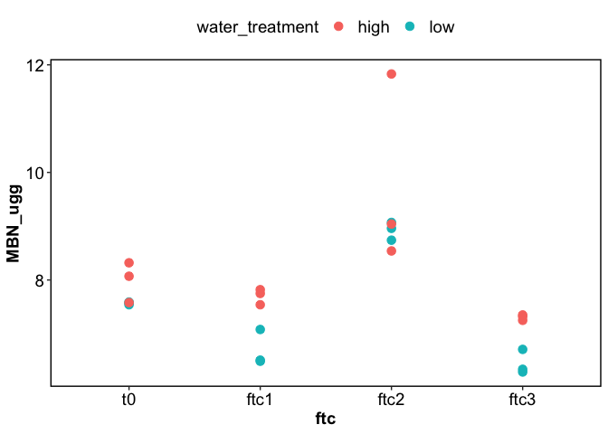<!-- -->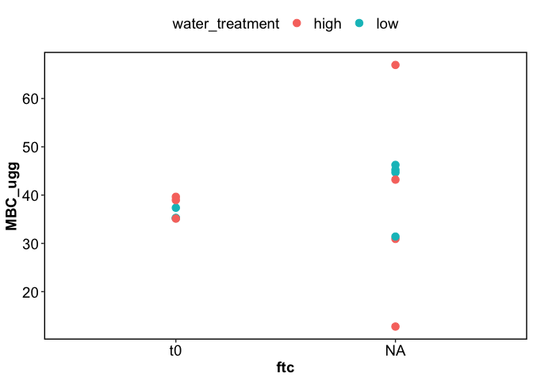<!-- -->

| water_treatment | ftc | MBC_ugg | MBN_ugg | TDN_ugg | WEOC_ugg | TotalC_percent | TotalN_percent |
|:---|:---|:---|:---|:---|:---|:---|:---|
| high | ftc1 | 42.45 ± 0.26 | 7.7 ± 0.08 | 10.96 ± 0.27 | 18.88 ± 0.73 | NA | NA |
| high | ftc2 | 47.41 ± 4.15 | 9.8 ± 1.02 | 16.43 ± 0.41 | 24.03 ± 1.02 | 3.11 ± 0.05 | 0.24 ± 0 |
| high | ftc3 | 39.27 ± 0.53 | 7.31 ± 0.03 | 15.13 ± 1.26 | 17.65 ± 1.48 | NA | NA |
| high | t0 | 37.91 ± 1.41 | 7.99 ± 0.22 | NA | 17.25 ± 1.24 | 3.17 ± 0.06 | 0.24 ± 0 |
| low | ftc1 | 36.09 ± 1.02 | 6.69 ± 0.19 | 9.17 ± 0.57 | 27.29 ± 0.73 | NA | NA |
| low | ftc2 | 42.99 ± 0.88 | 8.92 ± 0.1 | 9.29 ± 0.5 | 20.15 ± 0.33 | 3.23 ± 0.08 | 0.25 ± 0 |
| low | ftc3 | 34.53 ± 0.74 | 6.45 ± 0.13 | 10.81 ± 0.47 | 27.79 ± 1.72 | NA | NA |
| low | t0 | 35.96 ± 0.71 | 7.57 ± 0.01 | NA | 8.85 ± 1.29 | 3.25 ± 0.11 | 0.24 ± 0 |

------------------------------------------------------------------------

## Session Info

Session Info

Date run: 2025-12-30

    ## R version 4.5.0 (2025-04-11)
    ## Platform: aarch64-apple-darwin20
    ## Running under: macOS Sequoia 15.7.3
    ## 
    ## Matrix products: default
    ## BLAS:   /Library/Frameworks/R.framework/Versions/4.5-arm64/Resources/lib/libRblas.0.dylib 
    ## LAPACK: /Library/Frameworks/R.framework/Versions/4.5-arm64/Resources/lib/libRlapack.dylib;  LAPACK version 3.12.1
    ## 
    ## locale:
    ## [1] en_US.UTF-8/en_US.UTF-8/en_US.UTF-8/C/en_US.UTF-8/en_US.UTF-8
    ## 
    ## time zone: America/Los_Angeles
    ## tzcode source: internal
    ## 
    ## attached base packages:
    ## [1] stats     graphics  grDevices utils     datasets  methods   base     
    ## 
    ## other attached packages:
    ##  [1] ggh4x_0.3.1         googlesheets4_1.1.1 lubridate_1.9.4    
    ##  [4] forcats_1.0.0       stringr_1.5.1       dplyr_1.1.4        
    ##  [7] purrr_1.0.4         readr_2.1.5         tidyr_1.3.1        
    ## [10] tibble_3.3.0        ggplot2_3.5.2       tidyverse_2.0.0    
    ## [13] tarchetypes_0.13.1  targets_1.11.3     
    ## 
    ## loaded via a namespace (and not attached):
    ##  [1] gtable_0.3.6         xfun_0.53            processx_3.8.6      
    ##  [4] lattice_0.22-6       gargle_1.5.2         callr_3.7.6         
    ##  [7] tzdb_0.5.0           vctrs_0.6.5          tools_4.5.0         
    ## [10] ps_1.9.1             PNWColors_0.1.0      generics_0.1.3      
    ## [13] base64url_1.4        parallel_4.5.0       pkgconfig_2.0.3     
    ## [16] Matrix_1.7-3         data.table_1.17.0    secretbase_1.0.5    
    ## [19] RColorBrewer_1.1-3   distributional_0.5.0 lifecycle_1.0.4     
    ## [22] compiler_4.5.0       farver_2.1.2         codetools_0.2-20    
    ## [25] carData_3.0-5        htmltools_0.5.8.1    yaml_2.3.10         
    ## [28] Formula_1.2-5        car_3.1-3            pillar_1.10.2       
    ## [31] abind_1.4-8          nlme_3.1-168         tidyselect_1.2.1    
    ## [34] digest_0.6.37        stringi_1.8.7        splines_4.5.0       
    ## [37] labeling_0.4.3       cowplot_1.1.3        fastmap_1.2.0       
    ## [40] grid_4.5.0           cli_3.6.5            magrittr_2.0.3      
    ## [43] broom_1.0.8          withr_3.0.2          prettyunits_1.2.0   
    ## [46] scales_1.4.0         backports_1.5.0      googledrive_2.1.1   
    ## [49] timechange_0.3.0     rmarkdown_2.29       igraph_2.1.4        
    ## [52] cellranger_1.1.0     hms_1.1.3            evaluate_1.0.3      
    ## [55] knitr_1.50           ggdist_3.3.3         mgcv_1.9-1          
    ## [58] rlang_1.1.6          Rcpp_1.0.14          glue_1.8.0          
    ## [61] rstudioapi_0.17.1    R6_2.6.1             fs_1.6.6

