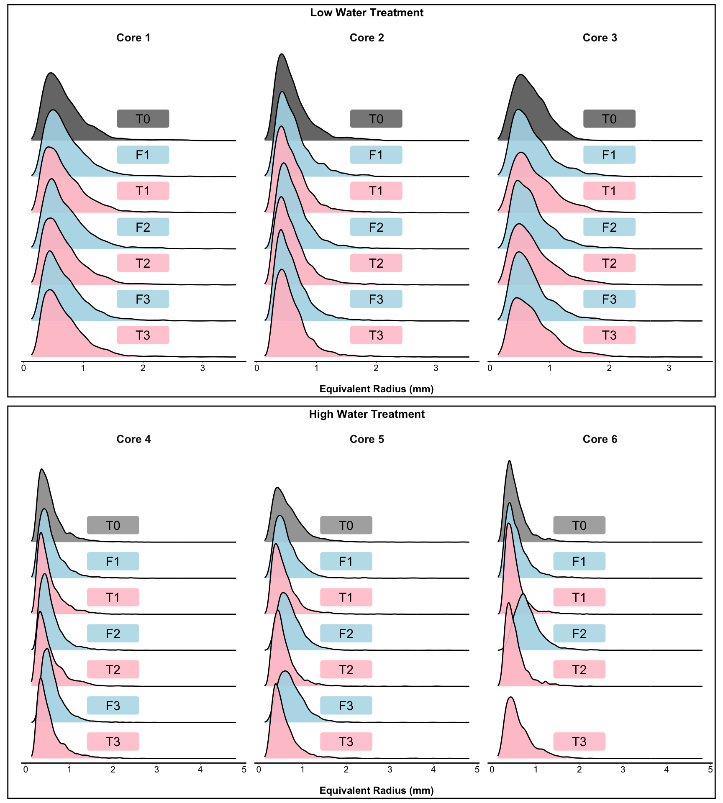
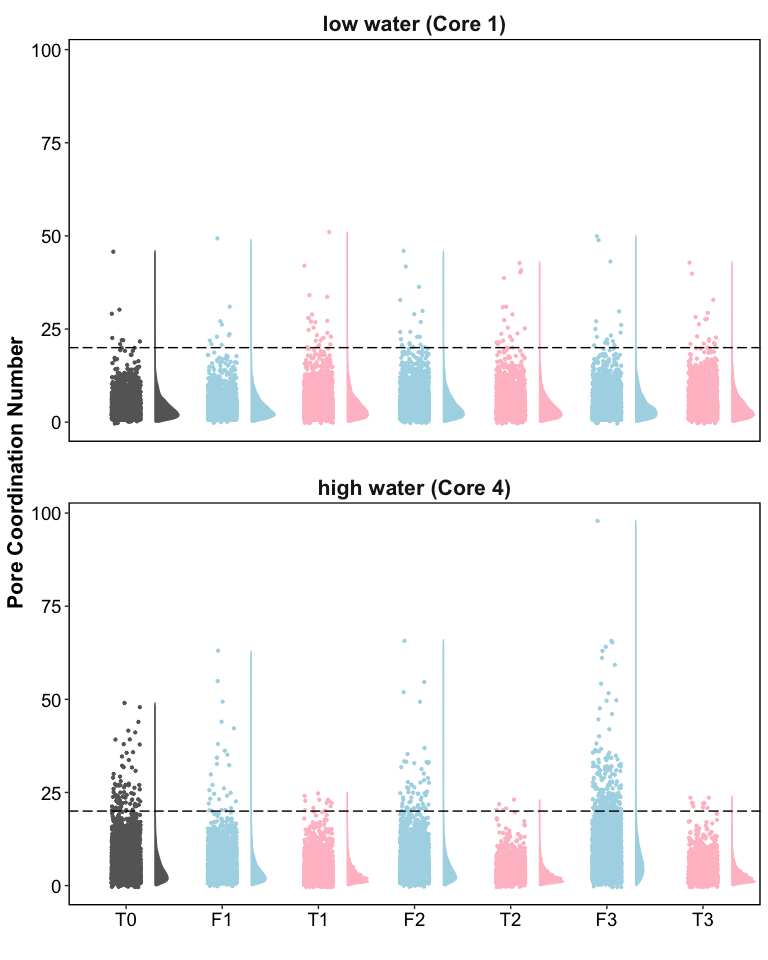
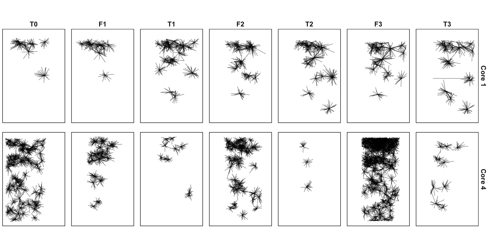
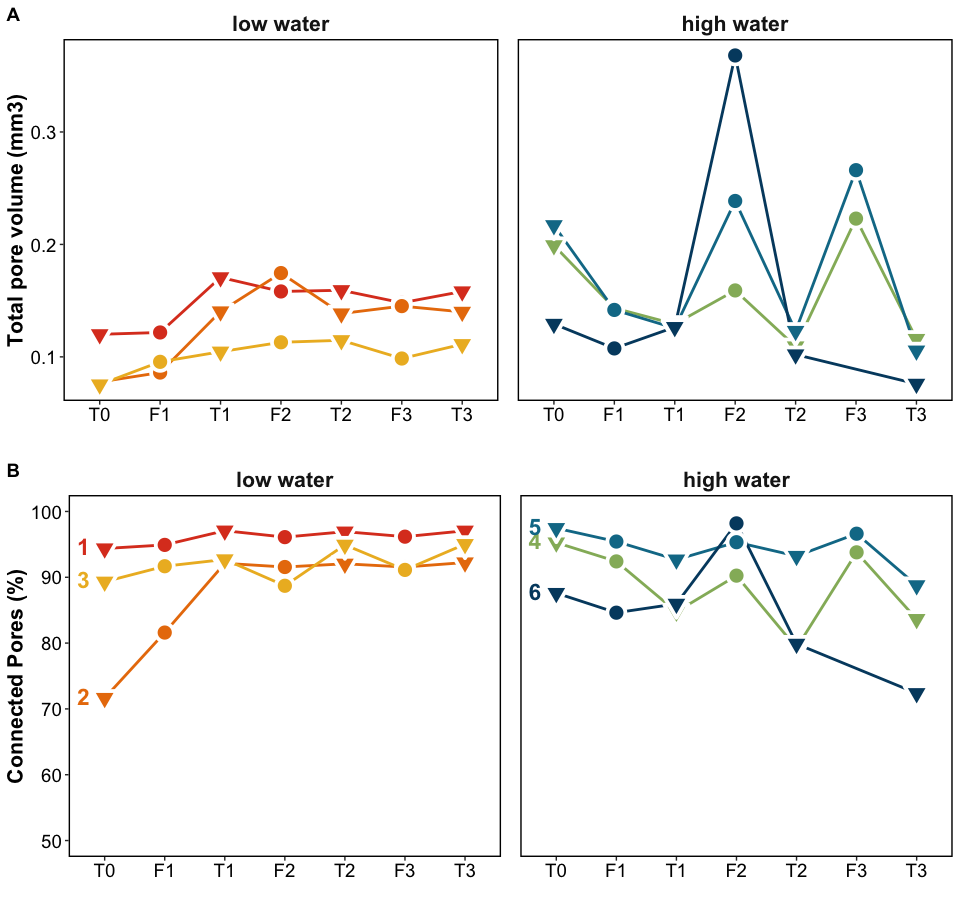
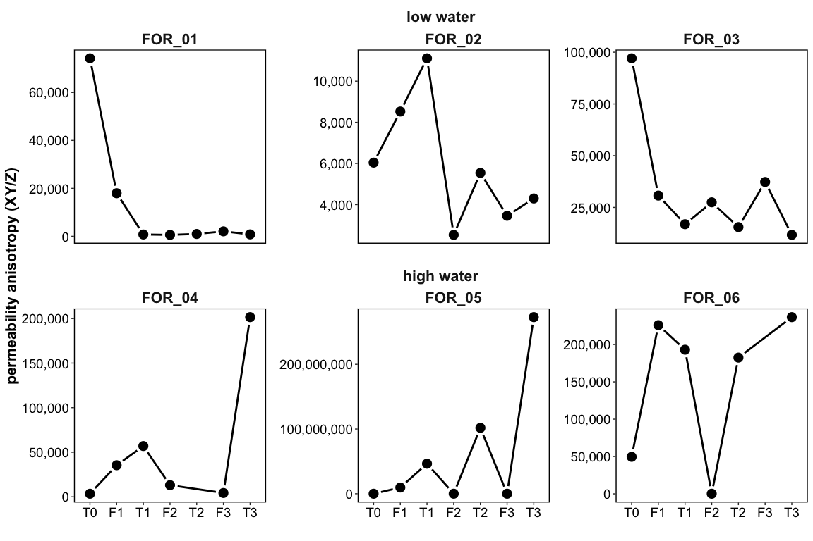
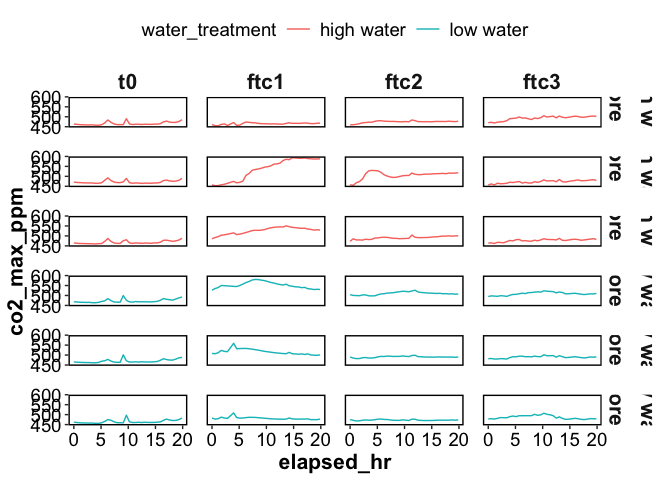
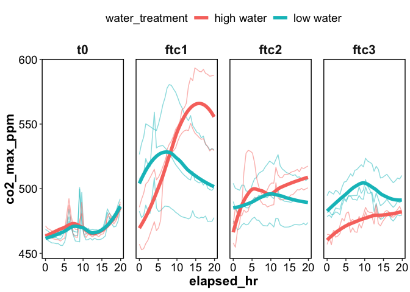
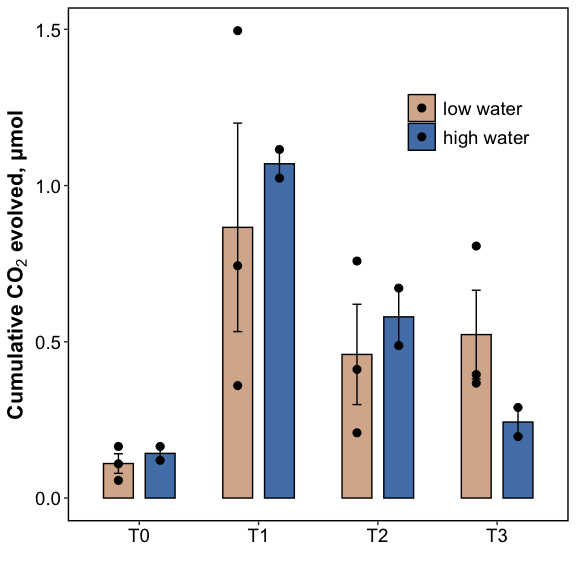

Untitled
================

# XCT

## PNM

#### Equivalent radius - distributions

<!-- -->

#### Coordination number

<!-- -->

#### Coordination map of pore throats

<!-- -->

## XCT core-scale metrics

<!-- -->

#### permeability anisotropy

<!-- -->

## XCT summary tables

#### Equivalent radius (mm)

    ## [1] "LOW WATER CORES"

| core_name | timepoint |  mean | median |   max |   min | .   |
|:----------|:----------|------:|-------:|------:|------:|:----|
| Core 1    | T0        | 0.695 |  0.603 | 2.902 | 0.198 | ab  |
| Core 1    | F1        | 0.717 |  0.623 | 3.335 | 0.166 | c   |
| Core 1    | T1        | 0.687 |  0.588 | 3.269 | 0.189 | a   |
| Core 1    | F2        | 0.704 |  0.609 | 3.295 | 0.186 | bc  |
| Core 1    | T2        | 0.683 |  0.588 | 3.558 | 0.176 | a   |
| Core 1    | F3        | 0.693 |  0.602 | 3.490 | 0.183 | ab  |
| Core 1    | T3        | 0.684 |  0.594 | 3.333 | 0.164 | a   |
| Core 2    | T0        | 0.609 |  0.526 | 2.428 | 0.201 | ab  |
| Core 2    | F1        | 0.624 |  0.550 | 2.138 | 0.135 | ac  |
| Core 2    | T1        | 0.594 |  0.522 | 3.112 | 0.168 | b   |
| Core 2    | F2        | 0.631 |  0.559 | 2.911 | 0.182 | c   |
| Core 2    | T2        | 0.590 |  0.513 | 3.011 | 0.172 | b   |
| Core 2    | F3        | 0.596 |  0.521 | 3.291 | 0.180 | b   |
| Core 2    | T3        | 0.586 |  0.512 | 2.979 | 0.159 | b   |
| Core 3    | T0        | 0.682 |  0.635 | 2.633 | 0.212 | a   |
| Core 3    | F1        | 0.718 |  0.626 | 3.016 | 0.130 | bc  |
| Core 3    | T1        | 0.754 |  0.658 | 2.839 | 0.204 | d   |
| Core 3    | F2        | 0.712 |  0.637 | 2.281 | 0.206 | abc |
| Core 3    | T2        | 0.732 |  0.639 | 2.787 | 0.207 | bd  |
| Core 3    | F3        | 0.701 |  0.616 | 3.123 | 0.187 | ac  |
| Core 3    | T3        | 0.729 |  0.650 | 2.954 | 0.187 | bd  |

    ## [1] "HIGH WATER CORES"

| core_name | timepoint |  mean | median |   max |   min | .   |
|:----------|:----------|------:|-------:|------:|------:|:----|
| Core 4    | T0        | 0.564 |  0.483 | 2.809 | 0.142 | a   |
| Core 4    | F1        | 0.581 |  0.501 | 2.898 | 0.175 | b   |
| Core 4    | T1        | 0.540 |  0.451 | 2.515 | 0.172 | c   |
| Core 4    | F2        | 0.570 |  0.498 | 2.756 | 0.165 | b   |
| Core 4    | T2        | 0.549 |  0.446 | 2.551 | 0.155 | d   |
| Core 4    | F3        | 0.620 |  0.551 | 2.938 | 0.191 | e   |
| Core 4    | T3        | 0.547 |  0.450 | 2.716 | 0.161 | cd  |
| Core 5    | T0        | 0.675 |  0.585 | 4.695 | 0.187 | a   |
| Core 5    | F1        | 0.644 |  0.569 | 4.021 | 0.130 | b   |
| Core 5    | T1        | 0.587 |  0.504 | 4.295 | 0.157 | cd  |
| Core 5    | F2        | 0.721 |  0.661 | 4.333 | 0.180 | e   |
| Core 5    | T2        | 0.578 |  0.500 | 4.110 | 0.198 | c   |
| Core 5    | F3        | 0.745 |  0.686 | 4.816 | 0.164 | f   |
| Core 5    | T3        | 0.576 |  0.485 | 4.369 | 0.168 | d   |
| Core 6    | T0        | 0.548 |  0.476 | 2.574 | 0.189 | a   |
| Core 6    | F1        | 0.574 |  0.496 | 2.446 | 0.184 | b   |
| Core 6    | T1        | 0.520 |  0.453 | 2.691 | 0.190 | c   |
| Core 6    | F2        | 0.817 |  0.761 | 2.957 | 0.208 | d   |
| Core 6    | T2        | 0.538 |  0.467 | 2.261 | 0.187 | a   |
| Core 6    | T3        | 0.616 |  0.522 | 2.246 | 0.199 | e   |

------------------------------------------------------------------------

# RESPIRATION

Click for timeseries figures

<!-- -->

<!-- -->

| timepoint |    pvalue |
|:----------|----------:|
| T0        | 0.5108032 |
| FTC1      | 0.6698716 |
| FTC2      | 0.6199897 |
| FTC3      | 0.2302419 |

<!-- -->

------------------------------------------------------------------------

# BIOGEOCHEMISTRY

| water_treatment | ftc | WEOC_ugg | TDN_ugg | MBC_ugg | MBN_ugg | TotalC_percent | TotalN_percent |
|:---|:---|:---|:---|:---|:---|:---|:---|
| low | T0 | 8.85 ± 1.29 | NA | 35.96 ± 0.71 | 7.57 ± 0.01 | 3.25 ± 0.11 | 0.24 ± 0 |
| low | T1 | 27.29 ± 0.73 | 9.17 ± 0.57 | 36.09 ± 1.02 | 6.69 ± 0.19 | 3.21 ± 0.05 | 0.25 ± 0.01 |
| low | T2 | 20.15 ± 0.33 | 9.29 ± 0.5 | 42.99 ± 0.88 | 8.92 ± 0.1 | 3.23 ± 0.08 | 0.25 ± 0 |
| low | T3 | 27.79 ± 1.72 | 10.81 ± 0.47 | 34.53 ± 0.74 | 6.45 ± 0.13 | 3.39 ± 0.33 | 0.26 ± 0.03 |
| high | T0 | 17.25 ± 1.24 | NA | 37.91 ± 1.41 | 7.99 ± 0.22 | 3.17 ± 0.06 | 0.24 ± 0 |
| high | T1 | 18.88 ± 0.73 | 10.96 ± 0.27 | 42.45 ± 0.26 | 7.7 ± 0.08 | 2.98 ± 0.12 | 0.24 ± 0.01 |
| high | T2 | 24.03 ± 1.02 | 16.43 ± 0.41 | 47.41 ± 4.15 | 9.8 ± 1.02 | 3.11 ± 0.05 | 0.24 ± 0 |
| high | T3 | 17.65 ± 1.48 | 15.13 ± 1.26 | 39.27 ± 0.53 | 7.31 ± 0.03 | 3.19 ± 0.13 | 0.26 ± 0.02 |

------------------------------------------------------------------------

## Session Info

Session Info

Date run: 2026-06-23

    ## R version 4.5.0 (2025-04-11)
    ## Platform: aarch64-apple-darwin20
    ## Running under: macOS 26.5.1
    ## 
    ## Matrix products: default
    ## BLAS:   /Library/Frameworks/R.framework/Versions/4.5-arm64/Resources/lib/libRblas.0.dylib 
    ## LAPACK: /Library/Frameworks/R.framework/Versions/4.5-arm64/Resources/lib/libRlapack.dylib;  LAPACK version 3.12.1
    ## 
    ## locale:
    ## [1] en_US.UTF-8/en_US.UTF-8/en_US.UTF-8/C/en_US.UTF-8/en_US.UTF-8
    ## 
    ## time zone: America/Los_Angeles
    ## tzcode source: internal
    ## 
    ## attached base packages:
    ## [1] stats     graphics  grDevices utils     datasets  methods   base     
    ## 
    ## other attached packages:
    ##  [1] ggh4x_0.3.1     lubridate_1.9.4 forcats_1.0.0   stringr_1.5.1  
    ##  [5] dplyr_1.2.0     purrr_1.0.4     readr_2.1.5     tidyr_1.3.2    
    ##  [9] tibble_3.3.1    ggplot2_4.0.2   tidyverse_2.0.0
    ## 
    ## loaded via a namespace (and not attached):
    ##  [1] gtable_0.3.6       xfun_0.53          insight_1.5.0      processx_3.8.6    
    ##  [5] lattice_0.22-6     callr_3.7.6        tzdb_0.5.0         vctrs_0.7.1       
    ##  [9] tools_4.5.0        ps_1.9.1           PNWColors_0.1.0    generics_0.1.3    
    ## [13] base64url_1.4      pkgconfig_2.0.3    Matrix_1.7-3       data.table_1.17.0 
    ## [17] secretbase_1.0.5   RColorBrewer_1.1-3 S7_0.2.0           lifecycle_1.0.5   
    ## [21] compiler_4.5.0     farver_2.1.2       codetools_0.2-20   carData_3.0-5     
    ## [25] htmltools_0.5.8.1  yaml_2.3.10        Formula_1.2-5      pillar_1.10.2     
    ## [29] car_3.1-3          abind_1.4-8        nlme_3.1-168       tidyselect_1.2.1  
    ## [33] digest_0.6.37      stringi_1.8.7      labeling_0.4.3     splines_4.5.0     
    ## [37] cowplot_1.1.3      fastmap_1.2.0      grid_4.5.0         cli_3.6.5         
    ## [41] magrittr_2.0.3     broom_1.0.12       withr_3.0.2        prettyunits_1.2.0 
    ## [45] scales_1.4.0       backports_1.5.0    timechange_0.3.0   rmarkdown_2.29    
    ## [49] igraph_2.1.4       hms_1.1.3          evaluate_1.0.3     knitr_1.50        
    ## [53] mgcv_1.9-1         rlang_1.1.7        glue_1.8.0         rstudioapi_0.17.1 
    ## [57] see_0.13.0         R6_2.6.1           targets_1.11.3

